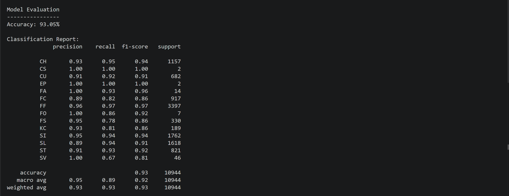
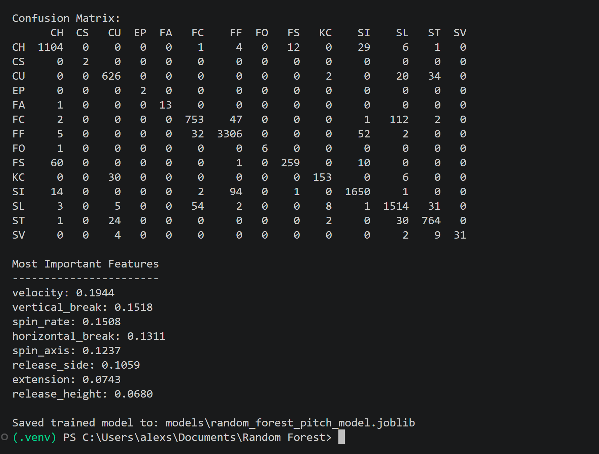
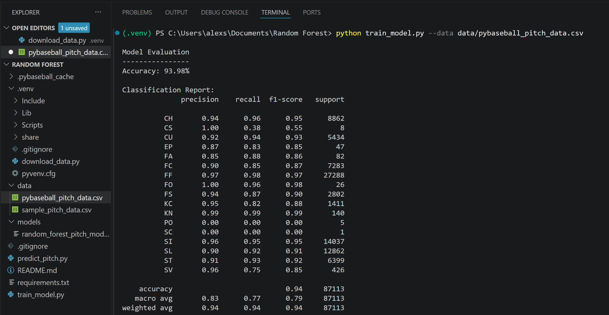
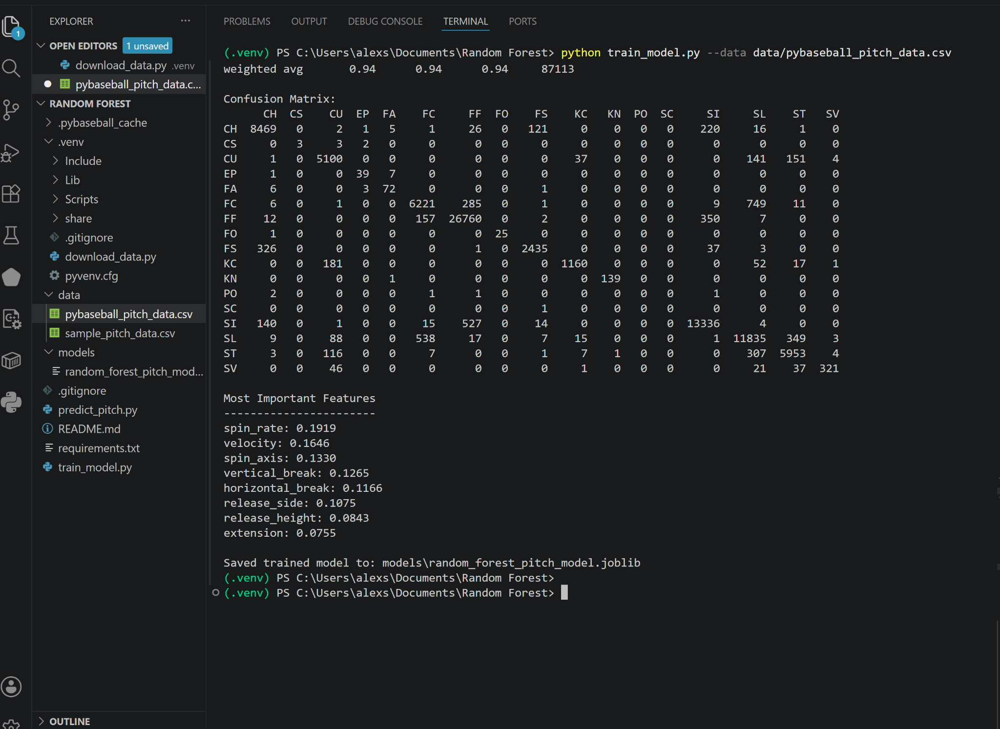
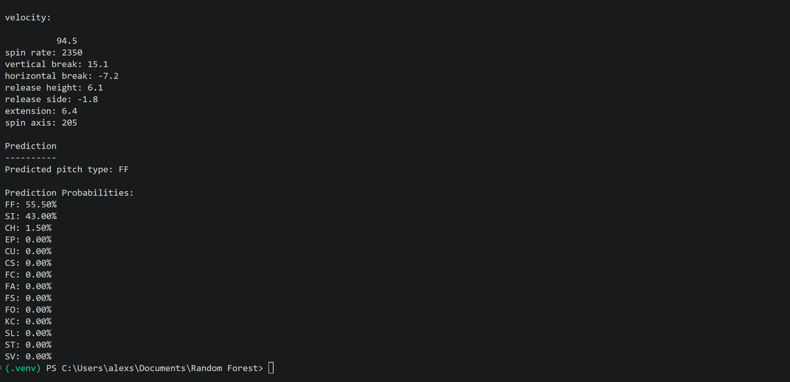

# Baseball Pitch Type Classifier

This project uses a Random Forest classifier to predict a baseball pitch type from pitch-tracking data. Instead of relying on one decision tree, the model builds many trees and lets them vote. That ensemble approach is a good fit for pitch classification because pitch types are separated by overlapping physical patterns: fastballs tend to be harder, breaking balls tend to move differently, and off-speed pitches can share traits with both.

The goal of the project is to show how machine learning can turn raw pitch measurements into an interpretable baseball decision model.

## What the Model Learns

Each row in the dataset represents one pitch. The target label is `pitch_type`, such as `FF` for four-seam fastball, `SL` for slider, `CH` for changeup, or `CU` for curveball.

The model uses these numeric features:

| Feature | What it tells the model |
| --- | --- |
| `velocity` | How hard the pitch was thrown |
| `spin_rate` | How quickly the ball was spinning |
| `vertical_break` | How much the pitch moved vertically |
| `horizontal_break` | How much the pitch moved side to side |
| `release_height` | Where the ball left the pitcher's hand vertically |
| `release_side` | Where the ball left the pitcher's hand horizontally |
| `extension` | How close to home plate the ball was released |
| `spin_axis` | The direction of the ball's spin |

Random Forests work especially well here because they can model non-linear relationships. A single feature rarely identifies a pitch by itself. For example, velocity can separate a fastball from a curveball, but it may not separate a four-seam fastball from a sinker. The forest combines many split decisions across velocity, movement, spin, and release point to find those more subtle patterns.

## How the Random Forest Works

The model trains many decision trees on different random samples of the pitch data. Each tree learns a set of yes-or-no rules, such as whether a pitch is above a certain velocity or has a certain amount of horizontal movement. When a new pitch is classified, every tree makes a prediction and the forest chooses the most common vote.

This helps in two ways:

- It reduces overfitting compared with one large decision tree.
- It gives feature importance scores, which show which measurements were most useful across the forest.

The classifier was also trained with balanced class weights so that common pitch types do not completely dominate rarer ones.

## Results

I tested the model on two dataset sizes to see how performance changed as more real pitch data was added.

### 50k+ Pitch Experiment

The smaller experiment, labeled **50k+ pitches** in the results deck, reached about **93.05% accuracy** on a test set of **10,944 pitches**.

The strongest pitch classes in this run were the common pitch types with many examples, such as four-seam fastballs, sinkers, sliders, changeups, and curveballs. Rare pitch types sometimes show perfect-looking precision or recall because there were only a few examples in the test set. That is a useful warning: high scores on tiny classes are less reliable than high scores on thousands of examples.

The confusion matrix shows the model's main mistakes. Similar pitch families are sometimes confused with each other, especially pitches that share movement profiles. For example, cutters and sliders can overlap, and some curveballs and sweepers/sliders can sit near each other depending on spin and movement.

In the 50k+ run, the most important features were:

| Rank | Feature | Importance |
| --- | --- | --- |
| 1 | `velocity` | 0.1944 |
| 2 | `vertical_break` | 0.1518 |
| 3 | `spin_rate` | 0.1508 |
| 4 | `horizontal_break` | 0.1311 |
| 5 | `spin_axis` | 0.1237 |

That result makes baseball sense. Pitch type is heavily shaped by speed, movement, spin, and spin direction.

### 350k+ Pitch Experiment

The larger experiment, labeled **350k+ pitches**, evaluated on **87,113 test pitches**. Accuracy improved to **93.98%**, with a weighted average F1-score of **0.94**.

The larger dataset made the results more trustworthy because the model saw many more examples of the major pitch types. Four-seam fastballs, sinkers, changeups, sliders, cutters, and sweepers all performed strongly. The weighted average stayed high because the model classified the most common pitch types accurately.

The macro average was lower than the weighted average because rare pitch types still had very little support. Classes such as pitchouts and screwballs had too few examples for the forest to learn them consistently. That difference is important: the model is very strong overall, but its reliability depends on how much data exists for each pitch type.

In the larger run, feature importance shifted slightly:

| Rank | Feature | Importance |
| --- | --- | --- |
| 1 | `spin_rate` | 0.1919 |
| 2 | `velocity` | 0.1646 |
| 3 | `spin_axis` | 0.1330 |
| 4 | `vertical_break` | 0.1265 |
| 5 | `horizontal_break` | 0.1166 |

The shift suggests that with more data, the model relied more on spin characteristics. That is a strong sign that the classifier was learning pitch shape, not just speed.

## Example Prediction

The model can also return probabilities, which are helpful when a pitch sits between two categories. In this example, the pitch is classified as a four-seam fastball, but the probability split shows it is close to a sinker profile.

That kind of output is more informative than a single label because it shows uncertainty. In baseball terms, it can reveal when two pitch types have similar physical traits.

## Takeaways

The project shows that a Random Forest can classify baseball pitch types with strong accuracy using only physical pitch measurements. The results also show why dataset size and class balance matter. Adding more pitches improved confidence in the results, but rare pitch types remained difficult because the model had limited examples to learn from.

The most important features across both experiments were velocity, spin rate, spin axis, and pitch movement. That matches how analysts and players talk about pitch identity: speed matters, but pitch shape is what separates similar offerings.

## Tech Stack

- Python
- pandas
- scikit-learn
- joblib
- pybaseball / Statcast-style pitch data
